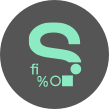

<h1 align="center">David Papamichael</h1>

[![JavaScript Commits][jscommits]](https://sourcerer.io/davidpaps)
[![Ruby Commits][rubycommits]](https://sourcerer.io/davidpaps)
[![Python Commits][pythoncommits]](https://sourcerer.io/davidpaps)
[![HTML Commits][htmlcommits]](https://sourcerer.io/davidpaps)
[![CSS Commits][csscommits]](https://sourcerer.io/davidpaps)

[jscommits]: https://img.shields.io/badge/JavaScript-424%20commits-yellow.svg
[rubycommits]: https://img.shields.io/badge/Ruby-383%20commits-red.svg
[pythoncommits]: https://img.shields.io/badge/Python-116%20commits-green.svg
[csscommits]: https://img.shields.io/badge/CSS-319%20commits-blue.svg
[htmlcommits]: https://img.shields.io/badge/HTML-385%20commits-black.svg

[_Projects_](#projects) | [_Skills_](#skills) | [_Education_](#education) | [_Work Experience_](#work-experience) | [_Interests_](#interests)

---

I’m a junior full-stack developer with a passion for problem solving and an eagerness to continue to learn. I am keen to combine my previous experience with new programming skills to contribute to solving real-world problems, currently I'm working on a [_Covid-19 Mapper_](https://covid-mapper.herokuapp.com/) to provide information on the current pandemic.

### Background

Before starting Makers Academy, I spent 7+ years in the medical field helping patients strategise treatment options for chronic spinal injuries. The role encompassed problem solving, a superb attention to detail, interpreting complex data and breaking it down into smaller components. I have always enjoyed puzzle games in my spare time, and after discovering Codewars I was immediately hooked on cracking these algorithmic riddles. I noticed there were similarities between programming and the aspects of my previous role where I excelled, and knew that this was a career meant for me!

---

## Projects

|                                                                                                                                   **Links**                                                                                                                                    |                                                                                                                                                        **Description**                                                                                                                                                        |                                     **Tech Used**                                      |
| :----------------------------------------------------------------------------------------------------------------------------------------------------------------------------------------------------------------------------------------------------------------------------: | :---------------------------------------------------------------------------------------------------------------------------------------------------------------------------------------------------------------------------------------------------------------------------------------------------------------------------: | :------------------------------------------------------------------------------------: |
|                                                            

                                                            |                           **B and Breakfast** - A 1 week group project that involved building a clone of Air Bnb. This was made into a single page JavaScript app. Users can sign up, make a listing, browse other listings and communicate through the interface to book using the Datepicker API.                           |         JavaScript, jQuery, HTML, CSS, Sinatra, Ruby, Jasmine, RSpec, Capybara         |
|    
 
    |                       **Acebook** - A 2 week group project that involved building a clone of facebook. A user can register, log in, and create posts, comments and likes on their own/and other users posts, with a live chat function for all users logged in. User can log in via OAUTH Github login.                       |     Ruby, Ruby on Rails, HTML, CSS, Bootstrap, Heroku, RSpec, Capybara, Travis CI      |  |
| 
 
  | **Pong!** - My 2 week final project that involved building a basic neural network in Python that leaned to play the classic video game pong. The neural net used the pixel data from the canvas as data to learn. A user could then play against this AI, or against another player in the online arcade built in Javascript. | JavaScript, jQuery, Python, Django, CSS, HTML, AWS, Heroku, Jasmine, Pytest, Travis CI |
| 
 
 |                             **Covid-19 Mapper** - A post Makers project built in React, A visual representation of the current worldwide Covid-19 crisis. A single page React app using API calls to show various statistical data for each country around the world, and each state for the USA.                             |        React, JavaScript, Bootstrap, CSS, HTML, Heroku, Jest, Enzyme, Travis CI        |

For a complete list of projects, see my [_Github_](https://github.com/davidpaps)

---

## Skills

#### Teamwork

I am an effective team member and enjoy helping everyone contribute towards reaching a common goal. During my first group project at Makers, I learnt the importance of daily stand ups and retrospectives, as tools to ensure the team was always on the same page. I championed the use of these in all future projects, which helped contribute to the successful end products and team cohesion.

#### Empathy

I believe the foundation to a successful team lies in empathetic communication. Empathy was essential in my previous career, I worked with patients in chronic pain and the ability to understand what they were going through and effectively communicate and strategise was key to helping them. On my final project at Makers, I worked with 4 other students who each had different strengths and abilities. I facilitated daily conversations with members of the team to ensure they each felt valued, listened to, and could share their ideas for the project.

#### Commitment

When I chose to leave a stable career to move into tech, I made the commitment to learn as much as possible and give it my all. While at Makers, I learnt a variety of practises, methodologies and technologies. Including, a new language, framework, and field (Python, Django, machine learning), in just two weeks during my final project - [_Pong!_](http://net-positive-pong-ai.herokuapp.com/). Since graduating, I have been learning React for a personal project - [_COVID-19 Tracker_](https://covid-mapper.herokuapp.com/). This evidences that I am committed to continued learning, and am comfortable self-learning.

---

## Education

#### Makers Academy (December 2019 to March 2020)

_A 16 week intensive developer bootcamp. This gave me a deep understanding into the fundamentals of software development, great coding principals and practises:_

- Agile methodologies
- XP Principals (with special focus on paired programming)
- Object Orientated Programming and software design
- Full Stack Web Development
- Independent Learning
- Test Driven/Behaviour Driven Development
- MVC framework with RESTful API structure

_Experience with the following tech:_

- Ruby, JavaScript, Python, React
- jQuery, HTML, CSS, Bootstrap
- Ruby on Rails, Django, Sinatra
- PostgreSQL, SQLite
- RSpec, Capybara, Jasmine, Jest, Pytest

#### The University of Essex (September 2007 - July 2011)

_Biological Science, Human Biology BSc(Hons)_

- 2:1
- Dissertation research published [_here_](https://www.ncbi.nlm.nih.gov/pubmed/22889688)
- Football captain & Mountaineering club travel secretary

---

## Work Experience

**The Harley Street Spine Clinic** (July 2014 - August 2019)
_Clinical Manager_

- I interpreted spinal medical imaging to patients, face to face, and discussed treatment options based on the results. Dealing with people in pain, and from all ages and walks of life helped me to hone my empathy skills, and interact in a sensitive but constructive way whilst enforcing a trusting bond with the patients.

**Spine Plus** (July 2012 - June 2014)
_Spinal Decompression Technician_

- I supervised spinal decompression machinery to treat patients with lumbar disc herniations. This role exposed me to a variety of people from all walks of life, and equipped me with the skills necessary to converse, strategise and find solutions for their ongoing back pain.

---

## Interests

- **Rock Climbing** - My other problem solving based passion in life. I believe this hobby/way of life, makes me a better programmer, for rock climbing is the physical equivalent of coding - how to get past an obstacle in the smartest and most efficient way possible.

- **Travelling** - I love to explore the world, discover new cultures and ways of life, it also goes hand in hand perfectly with Rock climbing.

- **Cooking** - I love to eat! And I love to cook, it also complements travelling, discovering new foods and tastes from around the world.
