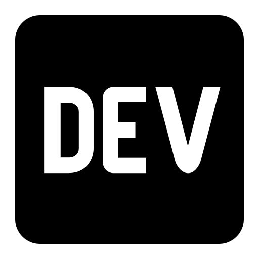

<h1 align="center">David Papamichael</h1>

[*Projects*](#projects) | [*Skills*](#skills) | [*Education*](#education) | [*Experience*](#experience) | [*Interests*](#interests)

---

I am a fresh graduate of the [*Makers Academy*](https://makers.tech/) developer bootcamp. I’m looking for a junior developer role which will allow me to consolidate and extend my programming knowledge, and expose me to the working life of a developer team in production. My time at Makers have given me a deep understanding into the fundamentals of software development, great coding principals and practises, all of which I am keen to implement in a professional environment based in the tech scene of London.

I have a passion for problem solving, and i'm not afraid to step out of my comfort zone to challenge myself.

After completing my Bachelor of Science and spending more than 7 years working in the medical field, I was looking for a new challenge. Becoming a developer felt like the logical progression for what I want out of a career. I realised that the fascinating parts of my job revolved around problem solving, and that my ability to interpret complex data and break it down into smaller components, would give me a great foundation to build on in the programming world. My time at Makers has enhanced these skills, and allowed me to become a competent and driven junior developer.

---

## Projects

|__Links__|__Description__|__Tech Used__|
|:-:|---|:-:|
|
 
| __'Acebook'__, - A 2 week group project that involved building a clone of facebook. A user can register, log in, and create posts, comments and likes on their own/and other users posts, with a live chat function for all users logged in.|Ruby, Ruby on Rails, HTML, CSS, Bootstrap, RSpec, Capybara|
|

| __'B and Breakfast'__, - A 1 week group project that involved building a clone of Air Bnb. This was made into a Single Page JavaScript App. Users can sign up, make a listing, browse other listings and communicate through the interface to book using the Datepicker API.| Javascript, JQuery, HTML, CSS, Sinatra, Ruby, Jasmine, RSpec, Capybara|
|
 
| __'Pong!'__ - My 2 week final project that involved building a basic neural network in Python that leaned to play the classic video game pong. The neural net used the pixel data from the canvas as data to learn. A user could then play against this AI, or against another player in the online arcade built in Javascript.|Javascript, JQuery, Python, Django, CSS, HTML, Jasmine, Pytest|

For a complete list of projects, see my [*Github*](https://github.com/davidpaps)

---

## Skills
I have several essential skills that I believe are of paramount importance for a software developer. These skills I used day to day in my previous roles, and during my time at Makers, I managed to apply these to my development work and hone them further:

#### Teamwork

I previously worked as part of a multi-disciplinary team that would triage patients to the correct area of treatment that they needed. On a daily basis I had to liaise with several members of staff, communicating my thoughts and findings, and discussing what the best course of action would be. This involved being a great team player, listening to each member of staff, and creating a safe - idea sharing atmosphere that everyone felt comfortable with, regardless of rank. This was evidenced in my second year with the company, I was selected to hold and mediate 'case-study' sessions we had every week, being noted for my excellent communication and organisation skills. This was further shown during my time at Makers when working on my final project. I worked with 4 other students who each had different strengths and abilities. I would host the daily morning stand-ups and the evening retrospectives, and make sure each member of the team felt valued, listened to, and could share their ideas for the project.

#### Empathy

During my previous roles over the last 7 years, I worked almost daily with patients in chronic pain. This gave me a unique set of empathy skills to communicate, explain and strategise with them in a sensitive manner. I acknowledged what they were going through, and would effectively translate in the easiest and most sensitive way possible what it is we could offer them in terms of treatment and relief. Working for over 7 years in this sector gave me a unique point of view when dealing with people from all walks of life and backgrounds. This was evidenced in my workplace by being promoted to Clinical Manager of the practise after 2 years of working there, being noted for my approachable attitude and my ability to explain a complex problem in a simple and succinct way. This was displayed throughout my time at Makers, I managed to work effectively with the cohort, producing a high level of work, no matter who I partnered with. I also set up a rock climbing social every week so that we could have some time to socialise and talk about our life outside of coding. This allowed me to connect personally with many of my peers, and form tighter bonds, which in turn created a better working atmosphere and a higher quality end product. I was also a mentor for 2 students at Makers in later cohorts, giving them advice, supporting them through their first few weeks on site, and being there if they needed anything.

#### Commitment

In my previous role, I would make it my personal goal to help my patients in any way I could. Dealing with such a sensitive matter as pain, it meant going the extra mile. This involved working out of office hours, hospital visits and calls in my personal time. I believe this in an important skill that is directly shown in this change in career. This was a conscious choice for me, to leave a stable and comfortable life and pursue a career in something I was genuinely fascinated with. It was not a snap decision, it was something that I gave great thought and planning to. I'm thrilled to have completed the course, this required extreme discipline and self belief to keep focused and not get overwhelmed with the fast pace and new topics that I discovered each week. This also showed my ability to pick up new technologies and concept quickly, showing that i am a fast learner with genuine enthusiasm.

---

## Education

#### Makers Academy (December 2019 to March 2020)
*A 16 week intensive developer bootcamp focusing on the following principals:*
- Implement ‘Agile’ methodologies, with special focus to paired programming
- Object Orientated Programming and software design
- Full Stack Web Development
- Independent Learning
- Test Driven/Behaviour Driven Development
- MVC framework with RESTful API structure

*Experience with the following tech:*
- Ruby, JavaScript, Python
- Ruby on Rails, Django, Sinatra
- PostgreSQL, SQLite
- RSpec, Capybara, Jasmine, Pytest

#### The University of Essex (September 2007 - July 2011)
*Biological Science, Human Biology BSc(Hons)*
- 2:1
- Dissertation research published [*here*](https://www.ncbi.nlm.nih.gov/pubmed/22889688)
- Football captain & Mountaineering club travel secretary  

---

## Experience

**The Harley Street Spine Clinic** (July 2014 - August 2019)   
*Clinical Manager*  
- I interpreted spinal medical imaging to patients, face to face, and discussed treatment options based on the results. Dealing with people in pain, and from all ages and walks of life helped me to hone my empathy skills, and interact in a sensitive but constructive way whilst enforcing a trusting bond with the patients.

**Spine Plus** (July 2012 - June 2014)    
*Spinal Decompression Technician*  
-  I supervised spinal decompression machinery to treat patients with lumbar disc herniations. This role exposed me to a variety of people from all walks of life, and equipped me with the skills necessary to converse, strategise and find solutions for their ongoing back pain.

---

## Interests

- __Rock Climbing__ - My other problem solving based passion in life. I believe this hobby/way of life, makes me a better programmer, for rock climbing is the physical equivalent of coding - how to get past an obstacle in the smartest and most efficient way possible.

- __Travelling__ - I love to explore the world, discover new cultures and ways of life, it also goes hand in hand perfectly with Rock climbing.

- __Cooking__ - I love to eat! And I love to cook, it also complements travelling, discovering new foods and tastes from around the world.